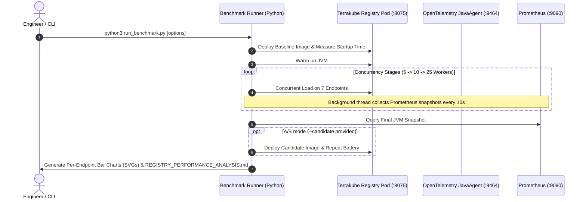

# Terrakube Registry Performance Benchmark Suite

This directory contains an automated, reproducible performance analysis and benchmarking suite for the **Terrakube Registry** component.

It supports both **A/B comparative evaluations** between container images (e.g. `azbuilder/open-registry:2.33.0-beta.10` vs `azbuilder/open-registry:2.33.0-beta.10-alpaquita`) and **single-image baseline profiling** when no candidate is specified.

---

## 1. Overview & Architecture

The benchmark harness tests all 7 methods across the 4 core registry controllers:

| Controller | Method | Path | Workload Characteristic |
| :--- | :--- | :--- | :--- |
| **`WellKnownWebServiceImpl`** | `GET` | `/.well-known/terraform.json` | Discovery JSON templating (Fast CPU/Memory) |
| **`ModuleWebServiceImpl`** | `GET` | `/terraform/modules/v1/{org}/{module}/{provider}/versions` | Database query + JSON serialization |
| **`ModuleWebServiceImpl`** | `GET` | `/terraform/modules/v1/{org}/{module}/{provider}/{version}/download` | DB count increment + `X-Terraform-Get` header |
| **`ModuleWebServiceImpl`** | `GET` | `/terraform/modules/v1/download/{org}/{module}/{provider}/{version}/module.zip` | Binary zip streaming (SeaweedFS S3) |
| **`ProviderWebServiceImpl`** | `GET` | `/terraform/providers/v1/{org}/{provider}/versions` | GraphQL/DB provider version listing |
| **`ProviderWebServiceImpl`** | `GET` | `/terraform/providers/v1/{org}/{provider}/{version}/download/{os}/{arch}` | Provider SHA256 & GPG download metadata |
| **`ReadMeWebServiceImpl`** | `GET` | `/terraform/readme/v1/{org}/{module}/{provider}/{version}/download` | In-memory ZIP uncompress + Markdown read |



---

## 2. Prerequisites

1. **Python 3.8+** (Uses standard library; no external dependencies required).
2. **SSH Access** to the MicroK8s host (`user@192.168.1.150` by default — override with `--ssh-host`).
3. **Network Access** to `https://terrakube-reg.microk8s.net` (or override with `--registry-url`).
4. **Authentication**: A valid bearer token supplied via `--token $TERRAKUBE_TOKEN_BENCHMARK` (required).

---

## 3. How to Execute the Benchmark

### A. Baseline-Only Profile (no candidate)
Profiles a single image without A/B comparison. All 4 charts and the report show only the baseline series:

```bash
cd /home/user/git/terrakube-io/terrakube/benchmarks/registry
python3 run_benchmark.py \
  --registry-url https://terrakube-reg.microk8s.net \
  --token $TERRAKUBE_TOKEN_BENCHMARK \
  --baseline azbuilder/open-registry:2.33.0-beta.10
```

### B. Full A/B Comparison
Executes automated rolling deployment of Baseline, runs the test battery, rolls out Candidate, runs the identical battery, restores the baseline image, and outputs a complete Markdown report with time-series SVG charts:

```bash
python3 run_benchmark.py \
  --registry-url https://terrakube-reg.microk8s.net \
  --token $TERRAKUBE_TOKEN_BENCHMARK \
  --baseline azbuilder/open-registry:2.33.0-beta.10 \
  --candidate azbuilder/open-registry:2.33.0-beta.10-alpaquita
```

### C. Use Plain `kubectl` Instead of `microk8s kubectl`
Pass `--kubectl-cmd kubectl` to target a standard cluster:

```bash
python3 run_benchmark.py \
  --kubectl-cmd kubectl \
  --ssh-host user@192.168.1.150 \
  --token $TERRAKUBE_TOKEN_BENCHMARK
```

### D. Quick Smoke Test (5s per stage, 10 workers)
Quick verification that all 7 endpoints, database fixtures, and telemetry queries are operational:

```bash
python3 run_benchmark.py --quick --token $TERRAKUBE_TOKEN_BENCHMARK
```

### E. Test Active Pod Without Triggering Image Rollouts

```bash
python3 run_benchmark.py \
  --skip-deploy \
  --registry-url https://terrakube-reg.microk8s.net \
  --token $TERRAKUBE_TOKEN_BENCHMARK \
  --workers 5 10 25 \
  --stage-duration 15
```

### F. Custom Concurrency and Duration

```bash
python3 run_benchmark.py \
  --workers 5 10 25 \
  --stage-duration 20 \
  --warmup 15 \
  --telemetry-interval 10 \
  --output-dir /home/user/git/terrakube-io/terrakube/benchmarks/results
```

---

## 4. Command-Line Arguments Reference

| Argument | Default | Description |
| :--- | :--- | :--- |
| `--registry-url` | `https://terrakube-reg.microk8s.net` | Registry base URL |
| `--token` | _(required)_ | Bearer token for authenticated endpoints. Pass via `--token $TERRAKUBE_TOKEN_BENCHMARK`. |
| `--ssh-host` | `user@192.168.1.150` | MicroK8s SSH target host |
| `--kubectl-cmd` | `microk8s kubectl` | kubectl command (`"microk8s kubectl"` or `"kubectl"`) |
| `--baseline` | `azbuilder/open-registry:2.33.0-beta.10` | Baseline container image tag |
| `--candidate` | _(none — baseline-only mode)_ | Candidate container image tag for A/B comparison |
| `--restore-image` | `azbuilder/open-registry:2.33.0-beta.10` | Image to restore when benchmark completes |
| `--workers` | `5 10 25` | Concurrency worker stages |
| `--stage-duration` | `15` | Test duration in seconds per stage |
| `--warmup` | `10` | Warm-up duration in seconds per pod |
| `--warmup-exclusion` | `3` | Duration in seconds discarded at the start of each stage (JIT warmup exclusion) |
| `--telemetry-interval` | `10` | Seconds between background Prometheus snapshots |
| `--skip-deploy` | `False` | Skip `kubectl set image` rollouts |
| `--quick` | `False` | Quick 5-second smoke test (10 workers only) |
| `--output-dir` | `../results` | Directory to save reports and diagrams |

---

## 5. Output Artifacts

After each run, the suite produces:
1. **`REGISTRY_PERFORMANCE_ANALYSIS.md`**: Complete performance report with summary tables, latency percentiles (p50, p90, p95, p99), stddev, min/max, throughput (RPS & MB/s), error rates, optional delta calculations (`%` speedup/regression), and telemetry insights.
2. **`latency_comparison_p95_p99.svg`**: Grouped bar chart — one sub-panel per concurrency level (5w / 10w / 25w), showing p50 / p90 / p95 / p99 bars for each of the 7 endpoints side-by-side.
3. **`throughput_vs_concurrency.svg`**: Grouped bar chart — one sub-panel per concurrency level, showing the RPS achieved by each endpoint individually.
4. **`throughput_bytes_sec.svg`**: Grouped bar chart — one sub-panel per concurrency level, showing data transfer throughput (MB/s) for each endpoint individually.
5. **`jvm_memory_and_gc.svg`**: JVM heap memory, committed memory, GC pause duration, container RSS, and JVM CPU utilization % **over time** (periodic Prometheus snapshots collected every `--telemetry-interval` seconds during the run).
6. **`container_cpu_and_startup.svg`**: Image size and cold-start bar panels + RSS memory time-series chart.

---

## 6. Directory Structure

```
terrakube/benchmarks/
├── registry/
│   ├── README.md             # This guide
│   ├── config.py             # Endpoint and cluster configurations
│   ├── seeder.py             # PostgreSQL and S3 test fixture seeder
│   ├── k8s_manager.py        # Remote MicroK8s image deployment & startup timing
│   ├── telemetry.py          # Prometheus & OpenTelemetry metric collector (with time-series support)
│   ├── load_generator.py     # Concurrent HTTP load engine (latency/status tracker)
│   ├── visualizer.py         # SVG time-series chart generator
│   ├── reporter.py           # Markdown report compiler (baseline-only & A/B modes)
│   └── run_benchmark.py      # Main CLI executable
└── results/                  # Generated reports and SVG diagrams
```
